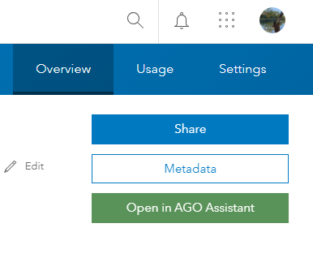

# AGOL Assistant Assistor

This extention is the AGOL Assistant's Assistant!

## What does it do?

The extention creates a button on each of your ArcGIS Online items' summary page which opens the item up in [ArcGIS Assistant](https://assistant.esri-ps.com/).

## Where can I use it?

The extention is designed for Chromium based browsers (Edge, Chrome, etc).

## Getting Started

This extention can be added to your browser via the extentions dev mode from code. I plan to make this available on the Chrome extention store in time.

## Affiliation

This extention is in no way affiliated with ESRI and provided simply as a tool to assist managing your content.
